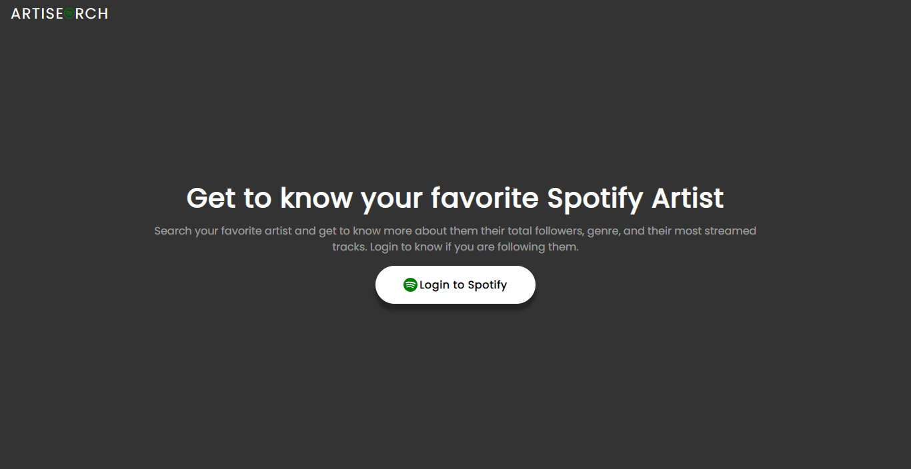
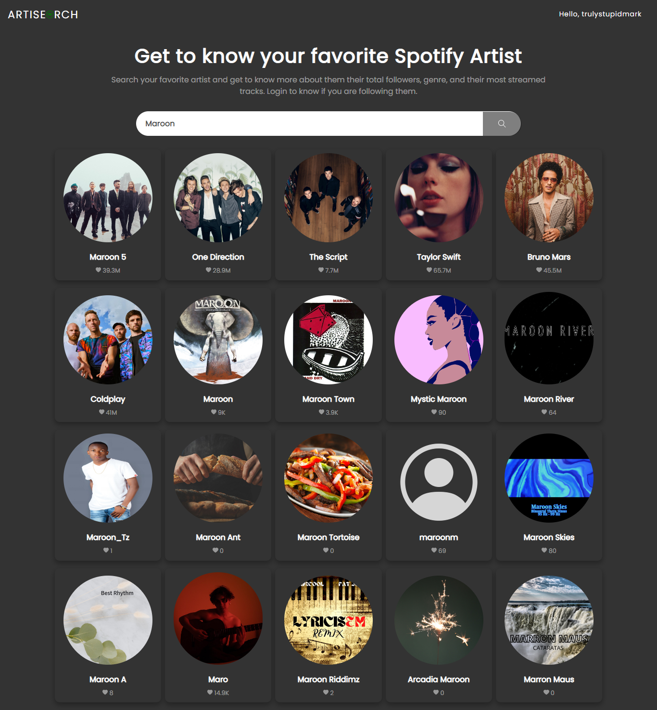
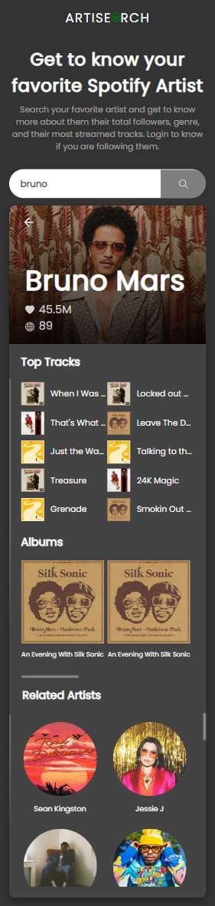

# Artisearch (React Application with Spotify API)

- This is a simple project using Spotify API. You can see your top tracks and artist and search your favorite artist.

### Screenshot

### Links

- Solution URL: [Click here...](https://github.com/markskwid/artisearch)
- Live Site URL: [View here...](https://markskwid.github.io/artisearch)

## My process

### Built with

- Semantic HTML5 markup
- CSS custom properties
- React
- Spotify API
- Flexbox
- CSS Grid
